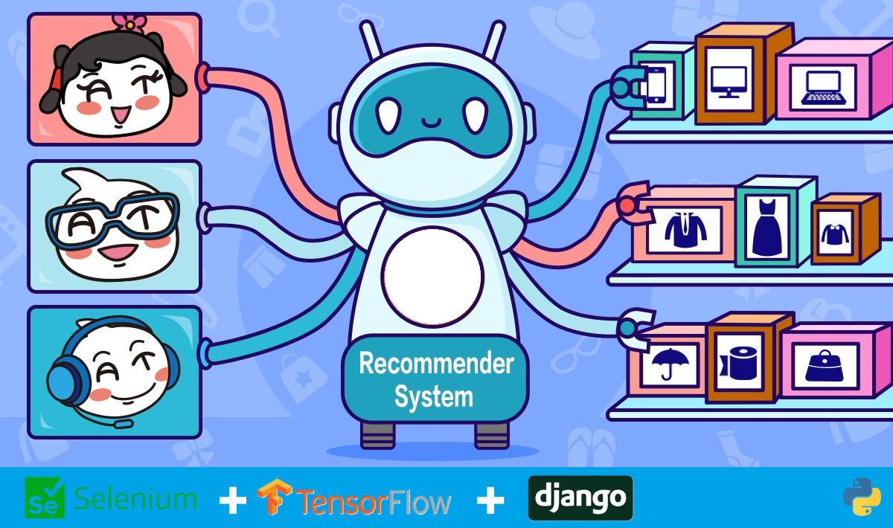

# E-Commerce Data Scraping and Recommendation Engine with Django



An end-to-end Django project that utilizes web scraping techniques to gather data from an e-commerce website and employs a recommendation system. Users can log in to discover personalized product recommendations based on their preferences. This project showcases the integration of Django with machine learning for an enhanced e-commerce experience

## Getting Started

These instructions will get you a copy of the project up and running on your local machine for development and testing purposes. See deployment for notes on how to deploy the project on a live system.

## Prerequisites
To run this software, you need to have Python installed on your computer.

## Installation
**1.** Clone the repo

```bash
git clone https://github.com/miracyuzakli/ecommerce-scraper-recommendation-django.git
```
**2.** Go into the project

```bash
cd ecommerce-scraper-recommendation-django
```
**3.** Create and activate a virtual environment

```bash
python -m venv venv
source venv/bin/activate  # Linux or macOS
# venv\Scripts\activate  # Windows
```
**4.** Install required packages

```bash
pip install -r requirements.txt
```
**5.** Apply database migrations and run the server

```bash
python manage.py migrate
python manage.py runserver
```
**6.** Load product data

```bash
python manage.py loaddata fixtures/products_data.json
```
**7.** Run the server again

```bash
python manage.py runserver
```

## Contributions

This project is open source and we welcome your contributions. If you'd like to contribute, feel free to fork the repository and submit pull requests.